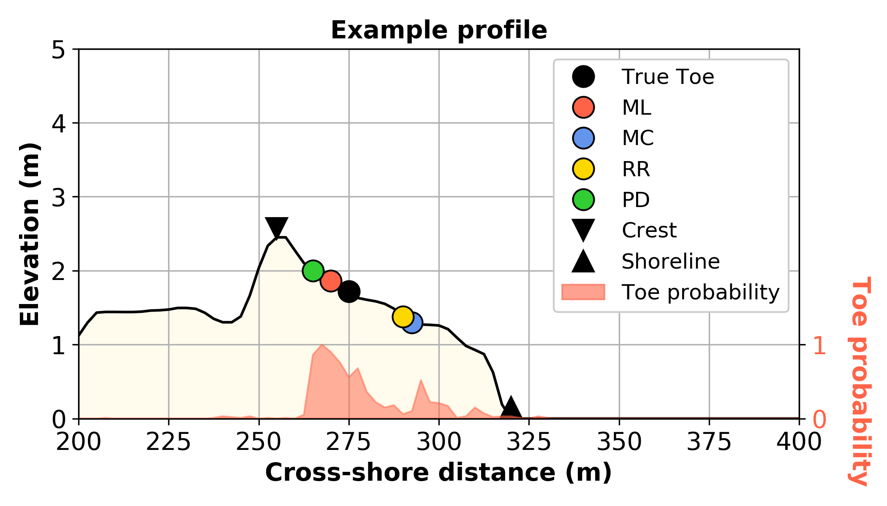

# **pydune**: A Python package for locating the dune toe on cross-shore beach profile transects.

<div align="center">
  
</div>

## What is it?
**pydune** is a python package for identifying dune toes on beach profile transects. It includes the following methods:
  - Machine learning
  - Maximum curvature (Stockdon et al, 2007)
  - Relative relief (Wernette et al, 2016)
  - Perpendicular distance

See the [*pydune* paper](paper.md) for more details.

## Usage
```sh
from pydune import Profile

# example data
x = np.arange(0, 80, 0.5)
z = np.concatenate((np.linspace(4, 5, 40),
                    np.linspace(5, 2, 10),
                    np.linspace(2, 0, 91)[1:],
                    np.linspace(0, -1, 20)))

# instantiate
p = Profile(x, z)

# predict dune toe, dune crest, shoreline location
toe_ml, prob_ml = p.predict_dunetoe_ml('wave_embayed_clf')  # predict toe using machine learning model
toe_mc = p.predict_dunetoe_mc()    # predict toe using maximum curvature method (Stockdon et al, 2007)
toe_rr = p.predict_dunetoe_rr()    # predict toe using relative relief method (Wernette et al, 2016)
toe_pd = p.predict_dunetoe_pd()    # predict toe using perpendicular distance method
crest = p.predict_dunecrest()      # predict dune crest
shoreline = p.predict_shoreline()  # predict shoreline
```

See the [example notebook](https://github.com/TomasBeuzen/pydune/blob/master/example.ipynb) for more details.

## References
Stockdon, H. F., Sallenger Jr, A. H., Holman, R. A., & Howd, P. A. (2007). A simple model for the spatially-variable coastal response to hurricanes. Marine Geology, 238, 1-20.

Wernette, P., Houser, C., & Bishop, M. P. (2016). An automated approach for extracting Barrier Island morphology from digital elevation models. Geomorphology, 262, 1-7.
