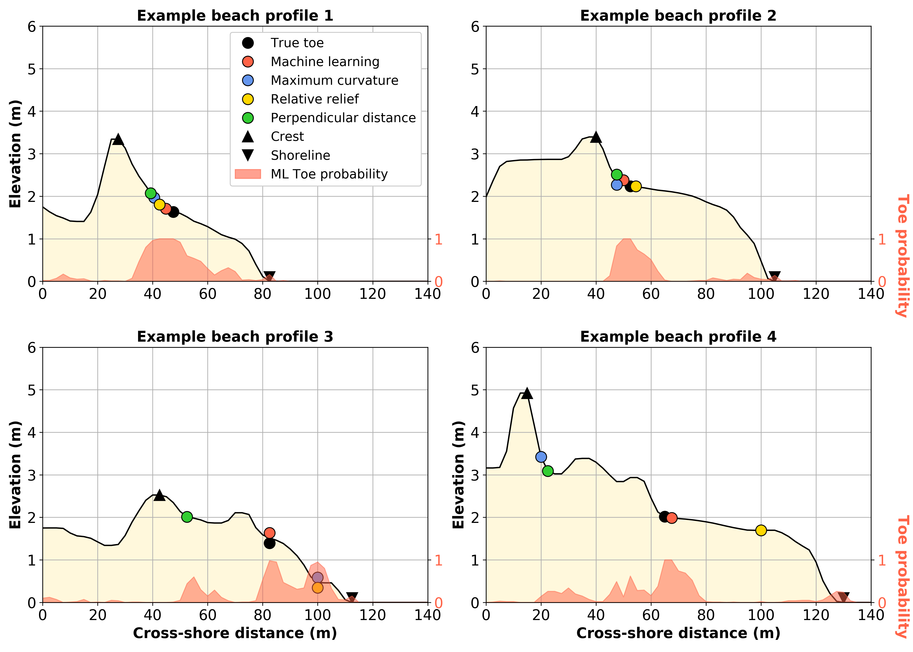

Welcome to pybeach's documentation!
===================================

.. image:: https://travis-ci.org/TomasBeuzen/pybeach.svg?branch=master
    :target: https://travis-ci.org/TomasBeuzen/pybeach
    :alt: Build Status

.. image:: https://readthedocs.org/projects/pybeach/badge/?version=latest
    :target: https://pybeach.readthedocs.io/en/latest/?badge=latest
    :alt: Documentation Status

.. image:: https://coveralls.io/repos/github/TomasBeuzen/pybeach/badge.svg?branch=master
    :target: https://coveralls.io/github/TomasBeuzen/pybeach?branch=master
    :alt: Coverage

**pybeach** is a Python package for locating the dune toe on cross-shore beach profile transects. 

..

    | Example application of **pybeach**.

Contents
~~~~~~~~

.. toctree::
   :maxdepth: 2

   background
   installation
   usage
   help

..