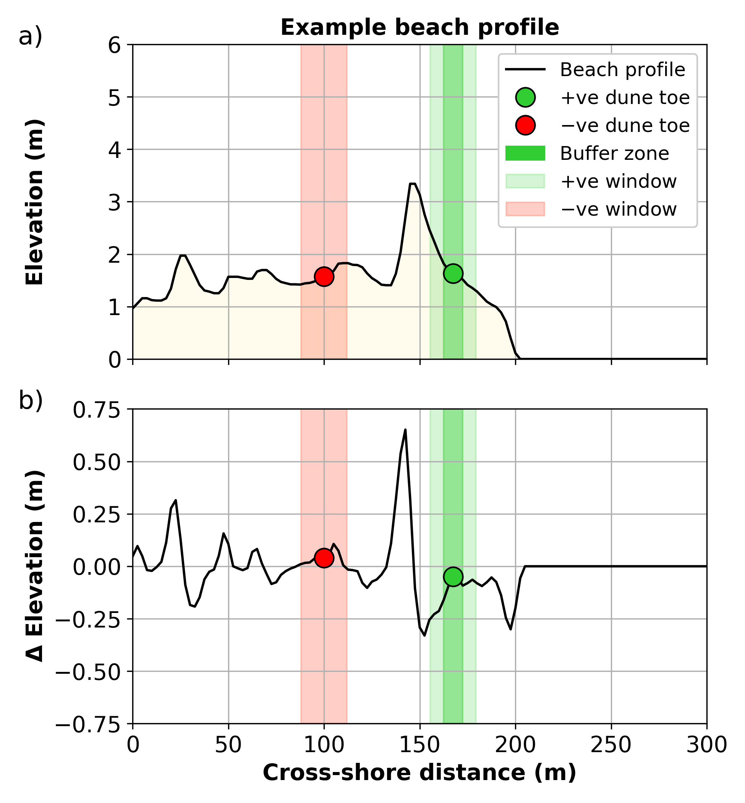

# Summary

Dunes along sandy coastlines provide an important natural barrier to coastal hazards. The capacity
of sandy dunes to provide coastal hazard protection depends in large part on their geometry. In
particular, the location of the dune toe (the transition point between the beach and dune) is a key
factor used in coastal erosion models and assessing coastal vulnerability [@Sallenger2000]. There
are many different algorithms currently available for automatically detecting the dune toe on 2D
cross-shore beaches profiles (hereafter referred to as "transects"). The *pydune* package documented
herein is motivated by two key aspects: 1. to collect existing done toe location algorithms in a
single, functional Python package; and, 2. to provide an additional new method for identifying dune
toe location based on machine learning.

*pydune* is an open-source Python package that allows a user to quickly and effectively identify the
dune toe location on 2d beach transects. The user inputs into *pydune* an array of cross-shore
coordinates of shape (*m*,)  and an array of corresponding elevations of shape (*m*,) for a single
transect or shape (*m*, *n*) for *n* transects that share the same cross-shore co-ordinates. The
user can then use *pydune* to identify the location of the dune toe using the following methods:

1. maximum curvature [@Stockdon2007] - the dune toe is defined as the location of maximum slope
   change;
2. relative relief [@Wernette2016] - the dune toe is defined based on relative relief (the ratio
   of local morphology to computational scale);
3. perpendicular distance - the dune toe is defined as the point of maximum perpendicular distance
   from the straight line drawn between the dune crest and shoreline; and,
4. a machine learning model - discussed further below.

Figure 1 shows an example of *pydune* applied to a beach profile transect. The machine learning
approach to identify the location of the dune toe is a random forest classifier trained on 1468
transects for which the exact dune toe location has been expertly identified. This is a novel
approach to detecting the dune toe which aims to address some of the issues with existing algorithms
(discussed further in Section [Statement of Need](#statement-of-need) below). When tested on 200
unseen profiles, the machine learning approach to dune toe detection outperformed the other methods
with a mean absolute error (MAE) of 7.96 m, compared to 10.51 m for the maximum curvature approach,
10.26 for the relative relief method, and 9.12 for the perpendicular distance method. An additional
benefit of the ML approach is that it outputs a probability distribution, describing the probability
a particular location is a dune toe, across the entire length of a transect which is useful for
correcting errors and interpreting beach morphology. Importantly, the methodology used to create the
dune toe machine learning model (described in Section [pydune](#pydune)) is an example of how
machine learning can be applied more generally to geomorphic and Earth surface systems.

*caption*

# Statement of Need

Domain experts are generally able to identify the location of the dune toe given a 2D transect of a
beach profile. However, recent improvement in coastal monitoring technologies (such a optical remote
sensing, LIDAR, and satellite remote sensing), have resulted in a significant increase in coastal
topographic data, for which analysis by an expert is infeasible. As a result, there has been
increased need for reliable and efficient algorithms for extracting important features such as dune
toes from these large coastal datasets. To date, several different algorithms have been developed
for this purpose, which, for example, define the dune toe based on profile curvature [@Stockdon2007]
or local relative relief [@Wernette2016]. However, a recent study by [@Wernette2018] that analysed
existing approaches for extracting dune toe locations on 2D beach transects found that there is
considerable variation in how these algorithms define and locate the dune toe. As a result, expert
checking is often required to validate the results of these algorithms. While an expert can
generally identify the dune toe on a given beach profile transect, it is difficult to develop an
algorithm that can reliably define the dune toe for the large variety of beach profile shapes
encountered in nature. Here we propose machine learning as an alternative approach to creating a
dune toe detection model. The idea is to directly encode expert knowledge to create a model that is
applicable to a large variety of beach profile shapes, and is scalable, such that it can be updated
and improved as additional data becomes available in the future. The methodology used to develop the
dune toe machine learning model is discussed in Section [pydune](#pydune) below.

Over the last decade or so, MATLAB has been the primary data processing environment in coastal
research. However, with increased use of open-source data, software, and machine learning, Python is
becoming a more popular programming language in coastal research and practice. An additional aim of
*pydune* is to collect existing dune toe location algorithms into a single, open-source Python
package to facilitate the progression of coastal research in Python.

# pydune

The *pydune* Python module provides a *Profile* class in *pydune.py*. This class contains methods
for defining the dune toe using each of the approaches listed above. *pydune* utilises support
functions located within the *classifier_support.py* and *data_support.py* modules. An instance of
the *Profile* class can be created using an array of cross-shore coordinates of shape (*m*,)  and an
array of corresponding elevations of shape (*m*,) for a single transect or shape (*m*, *n*) for *n*
transects that share the same cross-shore co-ordinates. Profiles should be oriented with the sea on
the right hand side of the 2D transect. Four methods may be called from an instance of the *Profile*
class to identify the dune toe location:

1. `Profile.predict_dunetoe_ml()` # dune to identified using machine learning model
2. `Profile.predict_dunetoe_mc()` # dune to identified using maximum curvature
3. `Profile.predict_dunetoe_rr()` # dune to identified using relative relief
4. `Profile.predict_dunetoe_pd()` # dune to identified using perpendicular distance

*pydune* also includes methods for identifying the dune crest (`Profile.predict_dunecrest()`) and
shoreline (`Profile.predict_shoreline()`) position on a beach transect; these methods are not
discussed here but further details can be found in the *pydune* documentation. The latter three dune
toe detection methods are described above in Section [Summary](#Summary). The novel dune toe
location method provided by *pydune* is the machine learning model. In fact, there are three models
provided with *pydune*:

1. a "barrier-island" model. This model was developed using XXX pre- and YYY post-Hurricane Ivan profiles from
   Santa-Rosa Island Florida (described here);
2. a "wave-emabyed" model. This model was developed using XXX pre- and YYY post-storm profiles derived from
   airbourne LIDAR from the wave-dominated, embayed SE Australian coasltine.
3. a "mixed" model combining the two above datasets

While these data are not yet publicly available, they cover a broad range of beach profile types and
provide a good basis for predicitng dune toe locations at other beaches. Nevertheless, the script
*create_classifier.py* has been included in the *pydune* repository to show users how these models
were created and to facilitate the creation of custom models from other datasets. This methodology
is described briefly below.

As beach profile transects can vary significantly in length (i.e., from 10’s of meters to 100’s of
meters), the machine learning models developed here were trained on fixed lengths of transect
(referred to as a “window”) instead of an entire transect, for which the model (a classifier)
predicts the probability of the dune toe being located at the centre of the window (e.g., Figure
2a). The elevation of beach profiles can also vary significantly. As model inputs should be as
generalized as possible, the gradient of profile elevations within a window (i.e., the first
derivative of the profile elevation) is used as input into the model (e.g., Figure 2b). Finally,
training a machine learning model requires examples of "windows" that both identify a dune toe and
do not identify a dune toe. The negative dune toe window can be a window centered at any point other
than the actual dune toe. However, it should not be so close to the actual dune toe as to confuse
the model. We therefore define a “buffer zone” around the actual dune toe location (Figure 2a) when
generating negative samples. A single negative dune toe sample was randomly extracted from each
beach profile during training, resulting in equal numbers of positive and negative dune toe windows.
A random forest classifier algorithm was used to develop the machine leanring models, with an
ensemble of 100 trees and no maximum depth. While different algoirhtms were trialled, the random
forest classifier gave the highest accuracy when tested on unseen data. In addition, it outputs a
probability of each location along a transect being a dune toe which can be useful for expert
interpretation. In practice, this is how the machine learning model in *pydune* operates. For a
given transect, *pydune* calculates the probability that each cross-shore coordinate is a dune toe.
It then selects the point of highest probability as the dune toe.

*caption*

Two key parameters of this machine learning approach were the window size and buffer size discussed
above. During model development, a cross-validation grid search was conducted over different values
of these two parameters, and it was found that a window size of 20 m and buffer size of 20 m was
found to be optimal. Code and Results of this grid search can be seen in See the supplemet figure X.

In developing the machine learning models, the full datasets discussed above were split into 80%
training and 20% test sets. Classifiers were then developed on the training data and performance on
the unseen test data was quantified and compared to the other dune toe detection algorithms. Figure
Y and Table Y show that the machine learning model outperformed the other classifiers on the unseen
test data.

*caption*

|    |   MAE |   RMSE |   R2 |
|:---|------:|-------:|-----:|
| ML |  7.96 |  11.52 | 0.95 |
| MC | 10.51 |  12.96 | 0.94 |
| RR | 10.26 |  12.83 | 0.94 |
| PD |  9.12 |  12.59 | 0.94 |

### Installation

```bash
pip install pydune
```

### Usage

Given an array of cross-shore coordinates, __*x*__ of shape (*m*,)  and corresponding elevations
__*z*__ of shape (*m*,) for a single profile or shape (*m*, *n*) for *n* profiles, `pydune` can be
used as follows to make predictions of the dune toe location:

```python
from pydune import Profile

# Instantiate Profile class
p = Profile(x = x, z = z, seaward_direction = "right")

# Make dune toe predictions
toe_ml = p.predict_dunetoe_ml() # use the machine learning (ML) method
toe_mc = p.predict_dunetoe_mc() # use the maximum curvature (MC) method
toe_rr = p.predict_dunetoe_rr() # use the relative relief (RR) method
toe_pd = p.predict_dunetoe_pd() # use the perpendicular distance (PD) method

```

The `pydune` source code can be found on [github](https://github.com/TomasBeuzen/pydune) along with
additional documentation and examples.

# Acknowledgements


# References