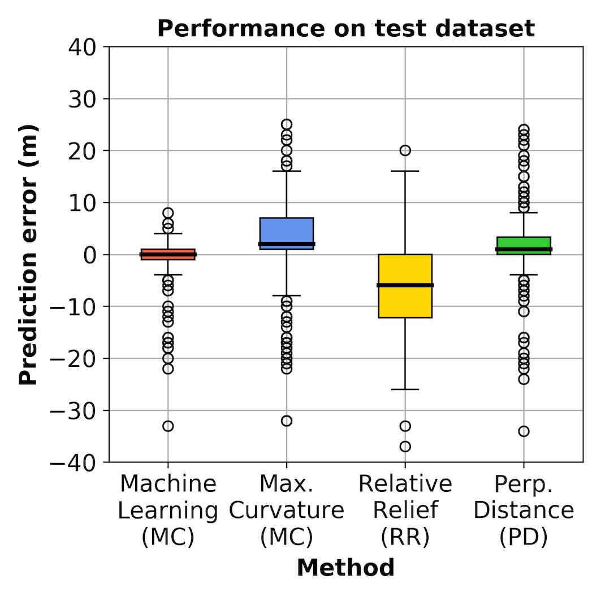

# Summary

Sandy coastlines typically comprise two key parts: a beach and dune. The beach is the section of sandy coast that is mostly above water (depending upon tide) and actively influenced by waves, while dunes are elevated mounds/ridges of sand at the back of the beach. The interface between the beach and dune is often characterised by a distinct change in ground slope (with the dune having a steeper slope than the beach). Dunes are particularly important along sandy coastlines because they provide a natural barrier to coastal hazards such as
storm-induced waves and surge. The capacity of sandy dunes to provide coastal hazard protection
depends in large part on their geometry. In particular, the location of the dune toe (the transition
point between the beach and dune) is a key factor used in coastal erosion models and for assessing
coastal vulnerability to hazards [@Sallenger2000]. There are many different algorithms currently
available for automatically detecting the dune toe on 2D cross-shore beach profiles. The __*pybeach*__
package documented herein is motivated by two key aspects:

1. to collect existing dune toe detection algorithms in a single, functional Python package; and,
2. to provide an additional new method for detecting dune toe location based on machine learning.

__*pybeach*__ is an open-source Python package that allows a user to quickly and effectively identify the
dune toe location on 2D beach profiles (e.g., **Figure 1**). The user inputs into __*pybeach*__ an array of
cross-shore coordinates of shape (*m*,)  and an array of corresponding elevations of shape (*m*,)
for a single profile or shape (*m*, *n*) for *n* profiles that share the same cross-shore
coordinates. The user can then use __*pybeach*__ to identify the location of the dune toe using the
following methods:

1. Maximum curvature [@Stockdon2007] - the dune toe is defined as the location of maximum slope
   change;
2. Relative relief [@Wernette2016] - the dune toe is defined based on relative relief (the ratio
   of local morphology to computational scale);
3. Perpendicular distance - the dune toe is defined as the point of maximum perpendicular distance
   from the straight line drawn between the dune crest and shoreline; and,
4. Machine learning using Random Forest classification - discussed further below.

**Figure 1** shows examples of __*pybeach*__ applied to different beach profile transects. The machine
learning (ML) approach to identifying the location of the dune toe is novel and aims to address some
of the issues with existing algorithms (discussed further in Section [Statement of
Need](#statement-of-need) below). As described further in Section [pybeach](#pybeach), when tested
on 200 unseen beach profiles, the ML approach to dune toe detection located the dune toe more
accurately than the other available methods. An additional benefit of the ML approach is that it
outputs a probability distribution across the length of a profile describing the probability of each
individual cross-shore location being a dune toe. This can be particularly useful for correcting
errors and interpreting beach morphology. Importantly, the methodology used to create the dune toe
ML model here (described in Section [pybeach](#pybeach)) is an example of how ML can be more
generally applied to geomorphic and Earth surface systems.


# Statement of Need

Domain experts are generally able to identify the location of the dune toe given a 2D beach profile.
However, recent improvements in coastal monitoring technologies (such as optical, Lidar, and
satellite remote sensing), have resulted in a significant increase in coastal topographic data, for
which analysis by an expert is infeasible. As a result, there has been increased need for reliable
and efficient algorithms for extracting important features such as dune toes from these large
coastal datasets. To date, several different algorithms have been developed for this purpose, which,
for example, define the dune toe based on profile curvature [@Stockdon2007] or local relative relief
[@Wernette2016]. However, a recent study by Wernette et al (2018) that analysed existing approaches
for extracting dune toe locations on beach profiles found that there is considerable variation in
the performance of these algorithms and expert checking is often required to validate results.
Furthermore, these algorithms typically require considerable subjective tuning of their parameters
to generate reasonable results [@Wernette2018]. While experts can generally identify the dune toe on
a beach profile, it is difficult to develop an algorithm that can consistently and reliably define
the dune toe for the large variety of beach profile shapes encountered in nature. Here, ML is used
as an alternative approach to creating a dune toe detection model. The idea is to directly encode
expert knowledge to create a model that is applicable to a large variety of beach profile shapes,
and is scalable, such that it can be updated and improved as additional data becomes available in
the future. The methodology used to develop the dune toe ML model in __*pybeach*__ is discussed in
Section [pybeach](#pybeach) below. An additional motivation of the __*pybeach*__ package is to
facilitate the progression of coastal research in Python. MATLAB has been the primary data
processing environment in coastal research over the last decade or so, however increased use of
open-source data, software, and machine learning, has resulted in Python becoming a more popular
programming language in coastal research and practice and __*pybeach*__ aims to continue and
contribute to this open-source movement.

# pybeach

__*pybeach*__ contains a *Profile* class in the *beach.py* module. This class contains methods for
defining the dune toe using each of the approaches listed above. __*pybeach*__ utilises support
functions located within the *classifier_support.py* and *data_support.py* modules. An instance of
the *Profile* class can be created using an array of cross-shore coordinates of shape (*m*,) and an
array of corresponding elevations of shape (*m*,) for a single profile or shape (*m*, *n*) for *n*
profiles that share the same cross-shore coordinates. Profiles should be oriented with the sea on
the right hand side. Four methods may be called from an instance of the *Profile* class to identify
the dune toe location:

1. `Profile.predict_dunetoe_ml()`  # machine learning method (ML)
2. `Profile.predict_dunetoe_mc()`  # maximum curvature method (MC)
3. `Profile.predict_dunetoe_rr()`  # relative relief method (RR)
4. `Profile.predict_dunetoe_pd()`  # perpendicular distance method (PD)

__*pybeach*__ also includes methods for identifying the dune crest (`Profile.predict_dunecrest()`)
and shoreline (`Profile.predict_shoreline()`) location on a beach profile; these methods are highly
useful for constraining the search area of the dune toe detection algorithms to the region between
the dune crest and shoreline and can be called using relevant parameters for each of the methods
above. See the relevant docstrings for further details. The latter three dune toe detection methods
above were described previously in Section [Summary](#Summary). The novel dune toe location method
provided by __*pybeach*__ is the ML method. In fact, three pre-trained ML models are provided with
the __*pybeach*__ package:

1. a "barrier-island" model. This model was developed using 1046 pre- and post- "Hurricane Ivan"
   airborne LIDAR profiles from Santa-Rosa Island Florida (this data was collected in 2004 and is
   described in [@Doran2018]);
2. a "wave-embayed" model. This model was developed using 1768 pre- and post- "June 2016 storm"
   airborne LIDAR profiles from the wave-dominated, embayed southeast Australian coastline (this
   data was collected in 2016 and is described in [@Harley2017]).
3. a "mixed" model. Developed using a combination of the two above datasets.

In addition to these three pre-trained ML models, the function *create_classifier()* in the
*classifier_support.py* module, allows users to create a custom ML model from their own data. As described below, the ML models provided in __*pybeach*__ are based on Random Forest classification and the *create_classifier()* function will create models based on this algorithm by default. However, __*pybeach*__ supports ML models developed using any scikit-learn classifier that supports probabilistic prediction (e.g., kNN, logistic regression, support vector classifier, etc.). The
methodology for creating a model is described briefly below and is demonstrated in the example
Jupyter notebook contained within the __*pybeach*__ [GitHub
repository](https://github.com/TomasBeuzen/pybeach/blob/master/example/example.ipynb).

For each dataset described above, the true location of the dune toe on each indiviudal profile transect was manually identified and quality checked by *multiple* experts and verified using satelitte imagery, digital elevation models and/or in-situ observations where available. This resulted in the best possible data to
facilitate the creation of the ML models in __*pybeach*__. As beach profile transects can vary significantly in
length (i.e., from 10’s of meters to 100’s of meters), the ML models developed here were created
using fixed lengths of transect (hereafter referred to as a “window”) instead of an entire transect
(**Figure 2a**). Given a window, the aim of the ML model is to predict the probability of a dune toe
being located at the center of the window. In practice, __*pybeach*__ creates a window around every
single cross-shore coordinate of an inputted profile and predicts the probability that each
cross-shore location is a dune toe, eventualy selecting the point of highest probability as the dune
toe. It was found that the gradient of profile elevations within a window (instead of the raw
elevations) was a more effective and generalizable input for the model (see **Figure 2b**). Training
the ML models required examples of windows that are both centered around a dune toe (positive
samples) and ones that are not centered around a dune toe (negative samples). The negative samples
can be a window centered at any point other than the actual dune toe. However, the samples should
not be so close to the actual dune toe as to confuse the model. Therefore a “buffer zone” is defined
around the actual dune toe location (**Figure 2a**) when generating negative samples, such that
negative samples can only be generated using points outside of the buffer zone. For each beach
profile used for model training, in addition to the one positive sample (i.e., the window centered
around the true dune toe), a single negative sample is also randomly extracted, resulting in equal
numbers of positive and negative dune toe windows for model training.


The "windows" are simply vectors of elevation change (the features), symmetrically centered around a
dune toe (positive sample, given a class label of 1) or some other random location that is not a
dune toe (negative sample, given a class label of 0). The scikit-learn Random Forest classifier
algorithm was used to develop the __*pybeach*__ ML models using these features and class labels,
with an ensemble of 100 trees and no maximum depth. While different algorithms were trialled, the
random forest classifier gave the highest accuracy during 10-fold cross-validation testing. In
addition, it can output the probability associated with predictions, i.e., in this case the
probability of a particular point being a dune toe, which can be highly useful for expert
interpretation and for better understanding beach morphology. The two key parameters of the ML
methodology discussed above are the window size and buffer size. During model development, a
cross-validation grid search was conducted over different values of these two parameters, and a
window size of 20 m and buffer size of 20 m were found to be optimal. However, users may adjust
these parameters when generating their own models.

### Performance Assessment

To test the performance of the dune toe location algorithms in __*pybeach*__, 200 profiles were
reserved as testing data and were not at all involved in ML model development. These profiles are
located in the __*pybeach*__ [GitHub
repository](https://github.com/TomasBeuzen/pybeach/tree/master/example). Figure 3 and Table 1 show
the performance of the different dune toe detection algorithms (ML, MC, RR, PD) and can be
reproduced using the example Jupyter notebook contained within the __*pybeach*__ [GitHub
repository](https://github.com/TomasBeuzen/pybeach/blob/master/example/example.ipynb). It can be
seen that the ML model considerably outperforms the other dune toe location algorithms for this
testing set of 200 beach profiles.




### Installation

__*pybeach*__ is available on the Python Package Index (PyPI) and can be installed with the
following:

```bash
pip install pybeach
```

### Usage

Given an array of cross-shore coordinates, __*x*__ of shape (*m*,)  and corresponding elevations
__*z*__ of shape (*m*,) for a single profile or shape (*m*, *n*) for *n* profiles, __*pybeach*__ can be
used as follows to make predictions of the dune toe location:

```python
from pybeach.beach import Profile

# Some syntehtic data
import numpy as np
x = np.arange(0, 80, 0.5)
z = np.concatenate((np.linspace(4, 5, 40),
                    np.linspace(5, 2, 10),
                    np.linspace(2, 0, 91)[1:],
                    np.linspace(0, -1, 20)))

# Instantiate Profile class
pb = Profile(x, z)

# Predict dune toe location
toe_ml = pb.predict_dunetoe_ml('mixed_clf') # use the machine learning (ML) method
toe_mc = pb.predict_dunetoe_mc() # use the maximum curvature (MC) method
toe_rr = pb.predict_dunetoe_rr() # use the relative relief (RR) method
toe_pd = pb.predict_dunetoe_pd() # use the perpendicular distance (PD) method

# Predict shoreline and dune crest location
crest = pb.predict_dunecrest()
shoreline = pb.predict_shoreline()
```

The __*pybeach*__ source code can be found on [github](https://github.com/TomasBeuzen/pybeach). Please see
the [example Jupyter
notebook](https://github.com/TomasBeuzen/pybeach/blob/master/example/example.ipynb) for
additional information on how to use __*pybeach*__ and to re-create figures presented in this paper.

### Future Work

An ambition of __*pybeach*__ is to act as a central repository for coastal data and algorithms
related to morphological and hydrodynamic calculations and to integrate with existing coastal Python
tools such as [CoastSat](https://github.com/kvos/CoastSat) [@Vos2019],
[py-wave-runup](https://github.com/chrisleaman/py-wave-runup) [@Leaman2019],
[CVNetica_VS](https://github.com/simmonsja/CVNetica_VS) [@Beuzen2019], and
[pyDGS](https://github.com/dbuscombe-usgs/pyDGS) [@Buscombe2013]. __*pybeach*__ was created in such
as way that it can easily be expanded upon in future. Immediate goals include adding capacity
to identify morphological features like dune toes from 3D coastal data (such as digital elevation
models) as well as adding new classes for the calculation of commonly used hydrodynamic parameters
(e.g., wave height, wave length, wave period, wave runup).

# Acknowledgements

I would like to thank those that contributed to the collection and processing of data used to
develop the ML models in __*pybeach*__. In particular, Dr. Mitchell Harley, Prof. Jason H. Middleton, Peter J. Mumford, and the UNSW School of Aviation for conducting the Airborne Lidar surveys and
Lidar data pre- processing for the June 2016 storm, and Dr. Kara Doran, Dr. Nathaniel
Plant, Dr. Hilary Stockdon, and the USGS for providing the Hurricane Ivan Lidar data, available
online [here](https://coastal.er.usgs.gov/data-release/doi-F7GF0S0Z/).

# References
