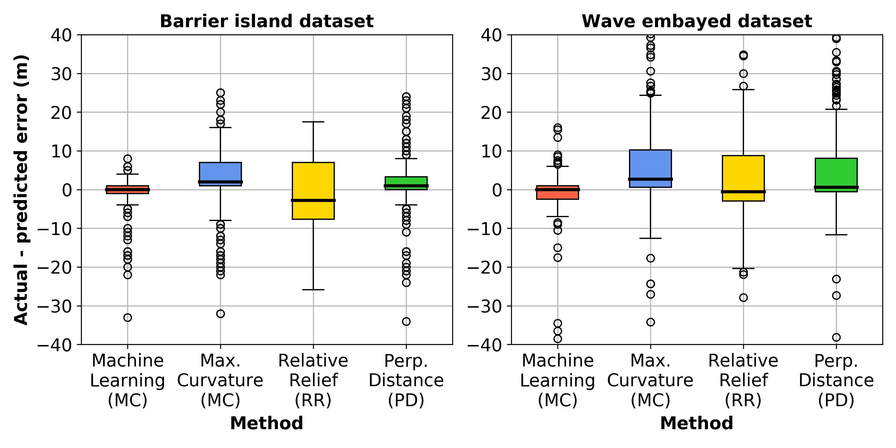

# Summary

Dunes along sandy coastlines provide an important natural barrier to coastal hazards such as
storm-induced waves and surge. The capacity of sandy dunes to provide coastal hazard protection
depends in large part on their geometry. In particular, the location of the dune toe (the transition
point between the beach and dune) is a key factor used in coastal erosion models and for assessing
coastal vulnerability to hazards [@Sallenger2000]. There are many different algorithms currently
available for automatically detecting the dune toe on 2D cross-shore beach profiles. The *pydune*
package documented herein is motivated by two key aspects:

1. to collect existing done toe detection algorithms in a single, functional Python package; and,
2. to provide an additional new method for detecting dune toe location based on machine learning.

*pydune* is an open-source Python package that allows a user to quickly and effectively identify the
dune toe location on 2D beach profiles (e.g., **Fig. 1**). The user inputs into *pydune* an array of
cross-shore coordinates of shape (*m*,)  and an array of corresponding elevations of shape (*m*,)
for a single profile or shape (*m*, *n*) for *n* profiles that share the same cross-shore
co-ordinates. The user can then use *pydune* to identify the location of the dune toe using the
following methods:

1. maximum curvature [@Stockdon2007] - the dune toe is defined as the location of maximum slope
   change;
2. relative relief [@Wernette2016] - the dune toe is defined based on relative relief (the ratio
   of local morphology to computational scale);
3. perpendicular distance - the dune toe is defined as the point of maximum perpendicular distance
   from the straight line drawn between the dune crest and shoreline; and,
4. a machine learning model - discussed further below.

**Fig. 1** shows an example of *pydune* applied to a beach profile transect. The machine learning
approach to identify the location of the dune toe is a novel approach to detecting the dune toe
which aims to address some of the issues with existing algorithms (discussed further in Section
[Statement of Need](#statement-of-need) below). As described further in Section [pydune](#pydune),
when tested on unseen data, the machine learning approach to dune toe detection outperformed the
other methods. An additional benefit of the ML approach is that it outputs a probability
distribution across the length of a profile describing the probability of each individudal location
being a dune toe. This can be particularly useful for correcting errors and interpreting beach
morphology. Importantly, the methodology used to create the dune toe machine learning model here
(described in Section [pydune](#pydune)) is an example of how machine learning can be usefully
applied to geomorphic and Earth surface systems.

*caption*

# Statement of Need

Domain experts are generally able to identify the location of the dune toe given a 2D beach profile.
However, recent improvements in coastal monitoring technologies (such a optical, LIDAR, and
satellite remote sensing), have resulted in a significant increase in coastal topographic data, for
which analysis by an expert is infeasible. As a result, there has been increased need for reliable
and efficient algorithms for extracting important features such as dune toes from these large
coastal datasets. To date, several different algorithms have been developed for this purpose, which,
for example, define the dune toe based on profile curvature [@Stockdon2007] or local relative relief
[@Wernette2016]. However, a recent study by [@Wernette2018] that analysed existing approaches for
extracting dune toe locations on beach profiles found that there is considerable variation in the
performance of these algorithms and expert checking is often required to validate results. A key
issue is that, while experts can generally identify the dune toe on a beach profile, it is difficult
to develop an algorithm that can reliably define the dune toe for the large variety of beach profile
shapes encountered in nature. Here we propose machine learning as an alternative approach to
creating a dune toe detection model. The idea is to directly encode expert knowledge to create a
model that is applicable to a large variety of beach profile shapes, and is scalable, such that it
can be updated and improved as additional data becomes available in the future. The methodology used
to develop the dune toe machine learning model in *pydune* is discussed in Section [pydune](#pydune)
below. Over the last decade or so, MATLAB has been the primary data processing environment in
coastal research. However, with increased use of open-source data, software, and machine learning,
Python is becoming a more popular programming language in coastal research and practice. An
additional aim of *pydune* is to collect existing dune toe location algorithms into a single,
open-source Python package to facilitate the progression of coastal research in Python.

# pydune

The *pydune* Python module provides a *Profile* class in *pydune.py*. This class contains methods
for defining the dune toe using each of the approaches listed above. *pydune* utilises support
functions located within the *classifier_support.py* and *data_support.py* modules. An instance of
the *Profile* class can be created using an array of cross-shore coordinates of shape (*m*,) and an
array of corresponding elevations of shape (*m*,) for a single profile or shape (*m*, *n*) for *n*
profiles that share the same cross-shore co-ordinates. Profiles should be oriented with the sea on
the right hand side. Four methods may be called from an instance of the *Profile* class to identify
the dune toe location:

1. `Profile.predict_dunetoe_ml()` - dune to identified using machine learning method
2. `Profile.predict_dunetoe_mc()` - dune to identified using maximum curvature method
3. `Profile.predict_dunetoe_rr()` - dune to identified using relative relief method
4. `Profile.predict_dunetoe_pd()` - dune to identified using perpendicular distance method

*pydune* also includes methods for identifying the dune crest (`Profile.predict_dunecrest()`) and
shoreline (`Profile.predict_shoreline()`) position on a beach profile; these methods are highly
useful for constraining the search area of the algorithms above to the region between the dune crest
and shoreline and can be called using arguments within the methods above. See the *pydune*
documentation for further detailsß. The latter three dune toe detection methods are described above
in Section [Summary](#Summary). The novel dune toe location method provided by *pydune* is the
machine learning method. Three pre-trained machine learning models are provided with the *pydune*
package:

1. a "barrier-island" model. This model was developed using 1046 pre- and 361 post- "Hurricane Ivan"
   airborne LIDAR profiles from Santa-Rosa Island Florida (this data was collected in 2004 and is
   described in [@Doran2018]);
2. a "wave-embayed" model. This model was developed using 820 pre- and 948 post- "June 2016 storm"
   airborne LIDAR profiles from the wave-dominated, embayed southeast Australian coastline (this
   data was collected in 2016 and is described in [Harley2017]).
3. a "mixed" model. A combination of the two above datasets, with a total of 3236 profiles.

In addition to these three models, the script *create_classifier.py* has been included in the
*pydune* repository to show users how these models were created and to facilitate the creation of
custom models from other datasets. This methodology is described briefly below.

As beach profile transects can vary significantly in length (i.e., from 10’s of meters to 100’s of
meters), the machine learning models developed here were created using fixed lengths of transect
(referred to as a “window”) instead of an entire transect. Given a window, the aim of the machine
learning model is to predict the probability of a dune toe being located at the center of the window
(**Figure 2a**). In practice, *pydune* creates a window around every single cross-shore coordinate
of an inputted profile and predicts the probability that each cross-shore location is a dune toe,
selecting the point of highest probability as the dune toe. It was found that the gradient of
profile elevations within a window (instead of the raw elevations) was a more effective and
generalizable input into the model (**Figure 2b**). Training a model requires examples of windows
that are both centered around a dune toe (positive samples) and ones that are not centered around a
dune toe (negative samples). The negative samples can be a window centered at any point other than
the actual dune toe. However, the samples should not be so close to the actual dune toe as to
confuse the model. We therefore define a “buffer zone” around the actual dune toe location (**Figure
2a**) when generating negative samples, such that negative samples can only be generated using
points outside of the buffer zone. For each beach profile used for model training, in addition to
the one positive sample (i.e., the window centered around the true dune toe), a single negative
sample was randomly extracted, resulting in equal numbers of positive and negative dune toe windows.

*caption*

These windows are simply vectors of elevation change (the features), associated with a label of 1
(positive sample) or 0 (negative sample) (the class). A random forest classifier algorithm was used
to develop the machine learning models using these features and class labels, with an ensemble of
100 trees and no maximum depth. While different algorithms were trialled, the random forest
classifier gave the highest accuracy when tested on unseen data. In addition, it can output a
probability of each location along a transect being a dune toe which can be useful for expert
interpretation and for better understanding beach morphology. The two key parameters of the machine
learning methodology discussed above are the window size and buffer size. During model development,
a cross-validation grid search was conducted over different values of these two parameters, and a
window size of 20 m and buffer size of 20 m were found to be optimal. Results of this grid search can
be found in the *pydune* repository [here](link to figure). Further details of this methodology are
documented in the *classifier_support.py* module and *create_classifier.py* script.

In developing the machine learning models packaged with *pydune*, the datasets discussed above
were split into 80% training and 20% test sets. Models were then developed on the training data
(with the optimization mentioned above using only the training data split) and performance on the
unseen test data was quantified and compared to the other dune toe detection algorithms. Figure Y
and Table Y show that the machine learning model outperformed the other classifiers on the unseen
test data.

*caption*

|    |   MAE |   RMSE |   R2 |   MAE |   RMSE |   R2 |
|:---|------:|-------:|-----:|------:|-------:|-----:|
| ML |  7.96 |  11.52 | 0.95 |  9.52 |  15.52 | 0.90 |
| MC | 10.51 |  12.96 | 0.88 |  12.73 |  20.33 | 0.83 |
| RR | 10.26 |  12.83 | 0.89 |  15.44 |  19.12 | 0.85 |
| PD |  9.12 |  12.59 | 0.91 |  14.12 |  21.73 | 0.78 |

### Installation

```bash
pip install pydune
```

### Usage

Given an array of cross-shore coordinates, __*x*__ of shape (*m*,)  and corresponding elevations
__*z*__ of shape (*m*,) for a single profile or shape (*m*, *n*) for *n* profiles, `pydune` can be
used as follows to make predictions of the dune toe location:

```python
from pydune import Profile

# Instantiate Profile class
p = Profile(x = x, z = z, seaward_direction = "right")

# Make dune toe predictions
toe_ml = p.predict_dunetoe_ml() # use the machine learning (ML) method
toe_mc = p.predict_dunetoe_mc() # use the maximum curvature (MC) method
toe_rr = p.predict_dunetoe_rr() # use the relative relief (RR) method
toe_pd = p.predict_dunetoe_pd() # use the perpendicular distance (PD) method

```

The `pydune` source code can be found on [github](https://github.com/TomasBeuzen/pydune) along with
additional documentation and examples.

# Acknowledgements
I would like to thank Dr. Mitchell Harley and Dr. Kara Doran for their assistance with the data used for
the development of *pydune*.

# References